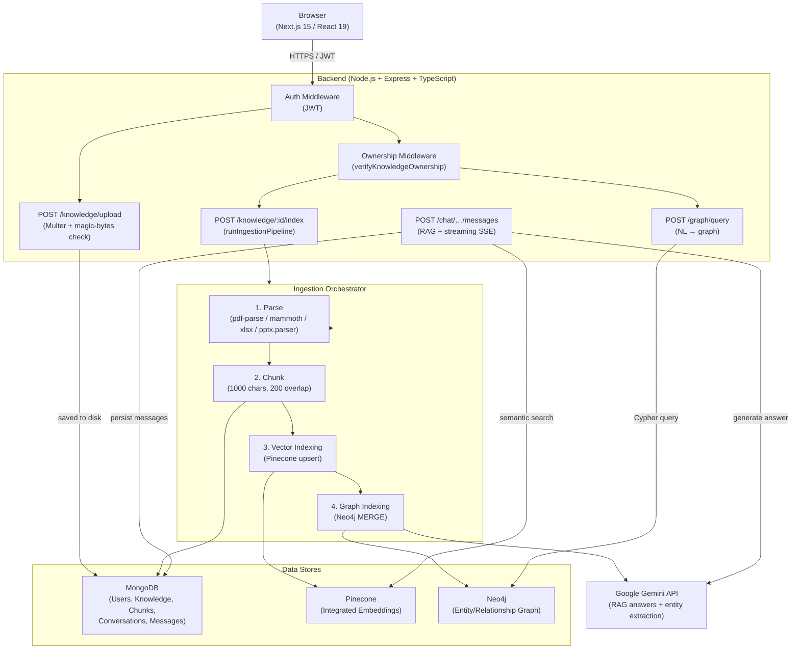

# NeuroStack AI

**NeuroStack AI** is a production-oriented, full-stack RAG (Retrieval-Augmented Generation) Document Intelligence Platform. Upload private documents and have grounded, real-time conversations with your knowledge base — powered by Google Gemini, Pinecone, Neo4j, and MongoDB.

---

## Architecture



---

## Key Features

### 1. Orchestrated Multi-Format Ingestion Pipeline
| Format | Parser | Notes |
|--------|--------|-------|
| PDF    | `pdf-parse` | page-by-page text + page numbers |
| DOCX   | `mammoth`  | clean text extraction |
| XLSX   | `xlsx`     | sheet-by-sheet CSV |
| PPTX   | `adm-zip` (custom) | **slide-by-slide**, sorted numerically |

Pipeline states tracked in MongoDB:
```
uploaded → processing → parsing → chunking → vector_indexing → graph_indexing → ready
                                                                              ↘ failed (step + error stored)
```
- Fully **idempotent**: retrying cleans up old chunks, Pinecone vectors, and Neo4j nodes before re-ingesting.
- Prevents race conditions: concurrent re-index within 5 minutes is blocked.

### 2. Knowledge Ownership Security (TASK 1)
Every knowledge endpoint is protected by the `verifyKnowledgeOwnership` middleware:
- `DELETE /api/knowledge/:id` — only the owner can delete
- `POST /api/knowledge/:id/index` — only the owner can index
- `POST /api/chat/conversations` — `knowledgeId` ownership is verified
- `POST /api/graph/query` — `knowledgeId` ownership is verified

Cross-user access returns **HTTP 403 Forbidden**.

### 3. Magic-Bytes File Validation
On upload, the server reads the first 4 bytes (magic bytes) of the file to verify it matches the declared extension — preventing spoofing (e.g., renaming `.exe` to `.pdf`).

### 4. High-Performance RAG Pipeline
- **Pinecone** stores embeddings using integrated vectorization (text → embedding happens inside Pinecone).
- **User-scoped filters** on every Pinecone search — no cross-user leakage.
- **Top-K retrieval** (default 8 chunks) fed into Gemini as grounded context.
- **SSE streaming** for token-by-token response delivery.

### 5. Knowledge Graph Intelligence (Neo4j)
- Entities extracted via Gemini: `Person`, `Organization`, `Technology`, `Project`, `Product`, `Concept`, `Location`.
- Relationships: `WORKS_AT`, `USES`, `CREATED`, `PART_OF`, `COMPETES_WITH`, `RELATED_TO`, …
- All nodes scoped by `userId` — full graph-level user isolation.
- Graph Explorer UI: natural-language → Cypher → entities + relationship paths + source citations.
- Server boots normally when Neo4j is unreachable (offline-tolerant).

### 6. Secure Authentication
- JWT-based, stored client-side as Bearer token.
- bcryptjs password hashing.
- Optional email verification (SMTP or dev URL fallback).
- Optional Google OAuth 2.0.
- Rate limiting: 500 req/15 min global, 100 req/15 min on `/api/auth`.

---

## Technology Stack

| Layer | Technology |
|-------|-----------|
| Frontend | Next.js 15 (React 19, TypeScript), Tailwind CSS, Framer Motion, TanStack Query |
| Backend | Node.js, Express 5, TypeScript, tsx |
| Databases | MongoDB (Mongoose), Pinecone, Neo4j |
| AI | Google Gemini (`@google/genai`) |
| File Handling | Multer, adm-zip, pdf-parse, mammoth, xlsx |
| Auth | jsonwebtoken, bcryptjs |
| Testing | Vitest |
| Containers | Docker, Docker Compose |

---

## Directory Structure

```text
NeuroStack-AI/
├── backend/
│   ├── src/
│   │   ├── config/          # MongoDB + Neo4j connection setup
│   │   ├── controllers/     # Auth, Knowledge, Chat controllers
│   │   ├── middleware/      # auth.middleware, upload.middleware, ownership.middleware
│   │   ├── models/          # User, Knowledge, KnowledgeChunk, Conversation, Message
│   │   ├── routes/          # auth, knowledge, chat, graph routes
│   │   ├── services/        # Pinecone, Gemini, Neo4j, document parsers,
│   │   │                    #   ingestion.orchestrator, pptx.parser, graph.*
│   │   └── server.ts
│   ├── .env.example         # Environment variable template (no real secrets)
│   ├── vitest.config.mts
│   └── package.json
├── frontend/
│   ├── src/
│   │   ├── app/             # Next.js pages (landing, login, register, dashboard)
│   │   ├── components/      # Shared UI components
│   │   ├── features/        # auth, chat, knowledge, graph features
│   │   └── services/        # API client
│   └── .env.example
├── docker-compose.yml
└── README.md
```

---

## Setup & Installation

### Prerequisites
- Node.js v18+
- MongoDB Atlas (or local) instance
- Pinecone account + index with integrated embeddings enabled
- Google Gemini API key
- Neo4j AuraDB instance (optional)

### Backend

```bash
cd backend
cp .env.example .env   # fill in your credentials
npm install
npm run dev            # http://localhost:5000
```

### Frontend

```bash
cd frontend
cp .env.example .env.local   # set NEXT_PUBLIC_API_URL
npm install
npm run dev                  # http://localhost:3000
```

---

## API Endpoints

### Auth (`/api/auth`)
| Method | Route | Purpose |
|--------|-------|---------|
| POST | `/register` | Register (returns `devVerificationUrl` when SMTP is off) |
| POST | `/login` | Sign in |
| POST | `/verify-email` | Verify email token |
| POST | `/resend-verification` | Resend verification link |
| GET  | `/google` | Start Google OAuth |
| GET  | `/google/callback` | OAuth callback |
| GET  | `/me` | Current user |
| PUT  | `/me` | Update profile |
| PUT  | `/password` | Change password |

### Knowledge (`/api/knowledge`)
| Method | Route | Purpose |
|--------|-------|---------|
| POST | `/upload` | Upload document (PDF/DOCX/XLSX/PPTX, max 50 MB) |
| GET  | `/` | List user's knowledge sources |
| POST | `/:id/index` | Run full ingestion pipeline (parse → chunk → vector → graph) |
| DELETE | `/:id` | Delete document + chunks + vectors + graph nodes |

### Chat (`/api/chat`)
| Method | Route | Purpose |
|--------|-------|---------|
| POST | `/conversations` | Create conversation |
| GET  | `/conversations` | List conversations |
| GET  | `/conversations/:id/messages` | Get messages |
| POST | `/conversations/:id/messages` | Send message (RAG) |
| POST | `/conversations/:id/messages/stream` | Stream message (SSE) |
| DELETE | `/conversations/:id` | Delete conversation |

### Graph (`/api/graph`)
| Method | Route | Purpose |
|--------|-------|---------|
| POST | `/query` | Natural-language graph query |
| POST | `/entity` | Direct entity lookup |
| GET  | `/stats` | Node/relationship counts for current user |

---

## Running Tests

```bash
cd backend
npm test
```

All tests use Vitest with mocked services (no external databases required). Covers:
- Auth controller (register, login, verify email, profile, password)
- Document chunking, XLSX extraction, PPTX slide-by-slide parsing
- Knowledge ownership middleware (401, 403, 404, correct owner)

---

## Docker

```bash
docker compose up --build
```

- Backend: `http://localhost:5000` · Frontend: `http://localhost:3000`
- Neo4j Browser: `http://localhost:7474` (credentials `neo4j` / `neurostack-dev`)
- Pass `GEMINI_API_KEY`, `PINECONE_API_KEY`, `PINECONE_INDEX_NAME`, `JWT_SECRET` via shell or a root `.env`.

---

## Security Considerations

- All secrets loaded from environment variables — never hardcoded.
- `.env` and `.env.local` are in `.gitignore` and have never been committed.
- File uploads validated by both MIME type allowlist **and** magic-byte signature check.
- Knowledge resource access gated by `verifyKnowledgeOwnership` on every relevant endpoint.
- Pinecone searches always include a `userId` filter — no cross-user vector leakage.
- Neo4j queries scoped by `userId` on every node and relationship.

---

## Verifying Neo4j Connectivity

```bash
cd backend
node test_neo4j_ops.js
```

If `No routing servers available` is reported, the Neo4j AuraDB instance is paused — resume it in the Aura console and retry. The backend tolerates an offline graph and logs `Graph DB features will be offline.`
