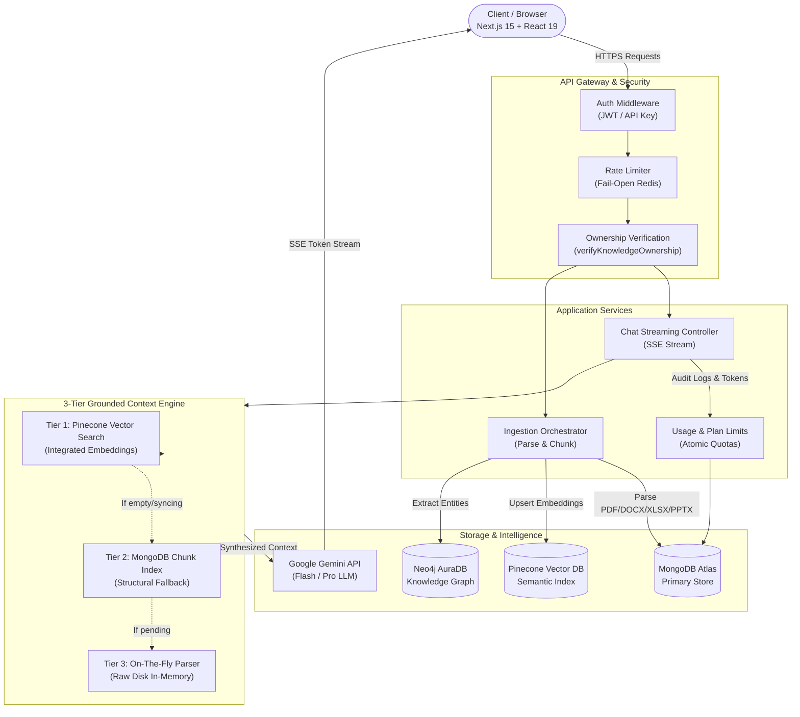

<div align="center">

# ⚡ NeuroStack AI
### Enterprise-Grade Document Intelligence & Graph RAG Platform

[](https://nextjs.org/)
[](https://react.dev/)
[](https://www.typescriptlang.org/)
[](https://nodejs.org/)
[](https://ai.google.dev/)
[](https://www.pinecone.io/)
[](https://neo4j.com/)
[](https://www.mongodb.com/)
[](https://vitest.dev/)

<p align="center">
  <b>A state-of-the-art Document Intelligence & Knowledge Platform combining Vector RAG, Knowledge Graph Exploration (Graph RAG), and real-time streaming generative AI.</b>
</p>

[Key Features](#-key-features) • [System Architecture](#-system-architecture) • [Tech Stack](#-technology-stack) • [Getting Started](#-getting-started) • [API Reference](#-api-reference) • [Author](#-author)

---

</div>

## 📌 Executive Summary

**NeuroStack AI** transforms static corporate and academic documents (PDF, DOCX, XLSX, PPTX) into active, conversational intelligence. By synthesizing **Pinecone Vector Search**, **Neo4j Knowledge Graphs**, and **Google Gemini Generative AI**, NeuroStack AI delivers grounded, hallucination-resistant answers with millisecond latency and deep semantic understanding.

Built with a **Next.js 15 (React 19)** frontend and a **Node.js/Express 5 + TypeScript** backend, the platform features enterprise-grade multi-tenancy, cryptographic document ownership protection, real-time Server-Sent Events (SSE) streaming, and an adaptive 3-tier retrieval fallback engine.

---

## 🚀 Key Features

### 1. ⚡ Instant Multi-Format Document Ingestion
- **Formats Supported**: PDF (`pdf-parse`), Word (`mammoth`), Excel (`xlsx`), PowerPoint (`adm-zip` slide-by-slide parser).
- **Magic-Byte Security**: Validates raw file signatures up to 1024 bytes (ISO 32000-1 compliant) to prevent extension spoofing.
- **Ultra-Fast Attachments**: Instant frontend attachment badge (`< 100ms`) with background fire-and-forget vector and graph indexing.

### 2. 🧠 Smart 3-Tier Grounded RAG Engine
Ensures **zero-downtime, zero-delay answers** even during high traffic or vector database warmup:
- **Tier 1 (Pinecone Integrated Vector Search)**: Top-K semantic chunks retrieval with strict per-user namespace isolation.
- **Tier 2 (MongoDB Chunks Fallback)**: Instant structural retrieval if vector index is still synchronizing.
- **Tier 3 (On-the-Fly Document File Parser)**: Direct in-memory parsing from disk for instant answer synthesis.

### 3. 🕸️ Knowledge Graph Intelligence (Graph RAG with Neo4j)
- **Automated Entity & Relation Extraction**: Extracts `Person`, `Organization`, `Technology`, `Project`, `Concept`, and `Location` entities via Gemini.
- **Graph Explorer**: Interactive visualization to traverse complex entity connections and discover non-obvious cross-document relationships.
- **Fault-Tolerant Operation**: Independent graph indexing ensures vector RAG continues to function 100% seamlessly even if Neo4j is offline.

### 4. 💬 ChatGPT / Gemini Grade Conversational Experience
- **Fluid SSE Streaming**: Low-latency token-by-token streaming responses with custom markdown and code syntax highlighting.
- **Intelligent Conversation Titling**: Automatically generates natural conversation titles from first messages, with full inline rename support.
- **Multi-Model Fallback Chain**: Automatically routes between `gemini-3.5-flash-lite`, `gemini-3.8-flash`, and `gemini-2.5-flash` with exponential backoff to eliminate 503 high-demand spikes.

### 5. 🛡️ Enterprise Security & Multitenancy
- **Strict Data Isolation**: Every vector query, graph node, and database record is cryptographically bound to the authenticated `userId`.
- **RBAC & Ownership Middleware**: `verifyKnowledgeOwnership` guarantees users can only access, query, or delete their own assets.
- **Fail-Open Redis Rate Limiter & Cache**: Uses `enableOfflineQueue: false` and strict timeouts to ensure zero request hangs even during Redis downtime.

### 6. 📊 Developer Platform & Telemetry
- **API Key Management**: Generate scoped API keys (`ns_live_...`) for programmatic REST API access.
- **Usage & Quota Engine**: Live tracking of token consumption, document count, and storage limits.
- **Interactive Swagger/OpenAPI 3.0**: Comprehensive interactive API documentation hosted at `/api-docs`.

---

## 🏗️ System Architecture


```mermaid
flowchart TD
    User([Client / Browser\nNext.js 15 + React 19])

    subgraph Edge ["API Gateway & Security"]
        AuthMid["Auth Middleware\n(JWT / API Key)"]
        RateLimit["Rate Limiter\n(Fail-Open Redis)"]
        OwnershipMid["Ownership Verification\n(verifyKnowledgeOwnership)"]
    end

    subgraph Core ["Application Services"]
        ChatCtrl["Chat Streaming Controller\n(SSE Stream)"]
        DocIngest["Ingestion Orchestrator\n(Parse & Chunk)"]
        UsageSvc["Usage & Plan Limits\n(Atomic Quotas)"]
    end

    subgraph RAGEngine ["3-Tier Grounded Context Engine"]
        T1["Tier 1: Pinecone Vector Search\n(Integrated Embeddings)"]
        T2["Tier 2: MongoDB Chunk Index\n(Structural Fallback)"]
        T3["Tier 3: On-The-Fly Parser\n(Raw Disk In-Memory)"]
    end

    subgraph AIStore ["Storage & Intelligence"]
        Gemini["Google Gemini API\n(Flash / Pro LLM)"]
        Mongo[(MongoDB Atlas\nPrimary Store)]
        Pinecone[(Pinecone Vector DB\nSemantic Index)]
        Neo4j[(Neo4j AuraDB\nKnowledge Graph)]
    end

    User -->|HTTPS Requests| AuthMid
    AuthMid --> RateLimit --> OwnershipMid
    OwnershipMid --> ChatCtrl
    OwnershipMid --> DocIngest

    DocIngest -->|Parse PDF/DOCX/XLSX/PPTX| Mongo
    DocIngest -->|Upsert Embeddings| Pinecone
    DocIngest -->|Extract Entities| Neo4j

    ChatCtrl --> RAGEngine
    RAGEngine --> T1
    T1 -.->|If empty/syncing| T2
    T2 -.->|If pending| T3

    RAGEngine -->|Synthesized Context| Gemini
    Gemini -->|SSE Token Stream| User
    ChatCtrl -->|Audit Logs & Tokens| UsageSvc
    UsageSvc --> Mongo
```

---

## 💻 Technology Stack

| Layer | Technologies |
|---|---|
| **Frontend** | **Next.js 15**, **React 19**, **TypeScript**, **Tailwind CSS**, **Framer Motion**, **Lucide Icons**, **Base UI** |
| **Backend** | **Node.js**, **Express 5**, **TypeScript**, **tsx** |
| **Generative AI** | **Google Gemini (`@google/genai`)** (`gemini-3.5-flash-lite`, `gemini-3.8-flash`) |
| **Vector Database** | **Pinecone** (Integrated Text Vectorization & Cosine Similarity) |
| **Graph Database** | **Neo4j AuraDB** (Cypher Query Language, Entity Relationship Mapping) |
| **Primary Database** | **MongoDB Atlas** (Mongoose ODM, Atomic Increments) |
| **Caching & Queues** | **Redis (ioredis)**, **BullMQ** (Fail-Open In-Memory Fallbacks) |
| **Document Processing**| `pdf-parse`, `mammoth` (DOCX), `xlsx` (Excel), `adm-zip` (PPTX) |
| **Testing & Quality** | **Vitest** (91 unit & integration tests), **Playwright** (E2E) |
| **Security & Auth** | **JWT**, **bcryptjs**, Magic-Byte Verification, Ownership Middleware |

---

## 📁 Repository Structure

```text
NeuroStack-AI/
├── backend/
│   ├── src/
│   │   ├── config/              # Database (MongoDB, Neo4j, Swagger, Plans)
│   │   ├── controllers/         # Auth, Chat, Knowledge, Graph, Analytics
│   │   ├── middleware/          # Auth, Ownership, Limits, Rate-Limiter, Upload
│   │   ├── models/              # Mongoose Schemas (User, Knowledge, Conversation, etc.)
│   │   ├── routes/              # Express REST & SSE Route Definitions
│   │   ├── services/            # Pinecone, Gemini, Ingestion Orchestrator, Redis Cache
│   │   │   ├── llm/             # LLM Registry & Multi-Model Gemini Provider
│   │   │   └── tools/           # AI Developer Tools (Summarizer, Bug Detector, etc.)
│   │   └── server.ts            # Application Entry Point
│   ├── .env.example             # Backend Environment Template
│   └── package.json
├── frontend/
│   ├── src/
│   │   ├── app/                 # Next.js 15 App Router (Dashboard, Login, Register)
│   │   ├── components/          # Reusable UI Design System (Buttons, Modals, Badges)
│   │   ├── features/            # Chat Workspace, Knowledge Manager, Graph Viewer
│   │   └── services/            # Type-Safe API Client
│   ├── .env.example             # Frontend Environment Template
│   └── package.json
├── docker-compose.yml           # Multi-Container Orchestration
└── README.md                    # Project Portfolio Documentation
```

---

## ⚡ Getting Started

### Prerequisites
- **Node.js**: v18.0.0 or higher
- **Package Manager**: npm or yarn
- **Databases**: MongoDB connection URI, Pinecone API Key, Google Gemini API Key

### 1. Clone the Repository
```bash
git clone https://github.com/mdzavedakhtar/NeuroAI.git
cd NeuroAI
```

### 2. Configure Environment Variables

**Backend Configuration (`backend/.env`):**
```env
PORT=5000
NODE_ENV=development
FRONTEND_URL=http://localhost:3000

MONGODB_URI=your_mongodb_connection_string
JWT_SECRET=your_jwt_secret_key

GEMINI_API_KEY=your_google_gemini_api_key
GEMINI_MODEL=gemini-3.5-flash-lite

PINECONE_API_KEY=your_pinecone_api_key
PINECONE_INDEX_NAME=your_pinecone_index_name

# Optional (for Graph RAG & Caching)
NEO4J_URI=neo4j+s://your_neo4j_aura_instance
NEO4J_USERNAME=neo4j
NEO4J_PASSWORD=your_neo4j_password
REDIS_URL=redis://127.0.0.1:6379
```

**Frontend Configuration (`frontend/.env.local`):**
```env
NEXT_PUBLIC_API_URL=http://localhost:5000/api
```

### 3. Install & Launch

```bash
# Terminal 1: Launch Backend
cd backend
npm install
npm run dev

# Terminal 2: Launch Frontend
cd frontend
npm install
npm run dev
```

Visit **`http://localhost:3000`** in your browser to start exploring!

---

## 🧪 Testing & Validation

The codebase includes comprehensive automated test coverage with mocked external dependencies to ensure reliability and speed:

```bash
cd backend
npm test
```

```text
✓ src/controllers/auth.controller.test.ts (18 tests)
✓ src/services/document.service.test.ts   (10 tests)
✓ src/middleware/ownership.middleware.test.ts (7 tests)
✓ src/middleware/rate-limiter.test.ts    (5 tests)
✓ src/services/tools/tools.test.ts       (5 tests)
✓ src/services/redis.cache.test.ts       (5 tests)
✓ src/services/prompt.service.test.ts    (4 tests)
...
Test Files  22 passed (22)
     Tests  91 passed (91)
  Duration  2.69s
```

Frontend typechecks pass with **0 TypeScript errors**:
```bash
cd frontend
npx tsc --noEmit
```

---

## 📡 API Reference Overview

| Module | Method | Endpoint | Description |
|---|---|---|---|
| **Auth** | `POST` | `/api/auth/register` | Register new user account |
| **Auth** | `POST` | `/api/auth/login` | Authenticate and obtain JWT |
| **Knowledge** | `POST` | `/api/knowledge/upload` | Upload document with magic-byte verification |
| **Knowledge** | `GET` | `/api/knowledge/:id` | Poll indexing pipeline status |
| **Knowledge** | `POST` | `/api/knowledge/:id/index` | Trigger vector & graph ingestion pipeline |
| **Chat** | `POST` | `/api/chat/conversations` | Initialize conversation (general or document-grounded) |
| **Chat** | `PUT` | `/api/chat/conversations/:id` | Rename conversation title |
| **Chat** | `POST` | `/api/chat/conversations/:id/messages/stream` | Stream grounded response using Server-Sent Events (SSE) |
| **Graph** | `POST` | `/api/graph/query` | Natural language Cypher query on knowledge graph |
| **API Keys** | `POST` | `/api/apikeys` | Create scoped API keys for external developers |

*For full interactive OpenAPI specs, visit `http://localhost:5000/api-docs`.*

---

## 👨‍💻 Author

**Md Zaved Akhtar**
- **GitHub**: [@mdzavedakhtar](https://github.com/mdzavedakhtar)
- **Project Repository**: [NeuroAI](https://github.com/mdzavedakhtar/NeuroAI)
- **Role**: Full-Stack AI Engineer & System Architect

---

<div align="center">
  <sub>Engineered with precision for scalable Document Intelligence. Distributed under the MIT License.</sub>
</div>
