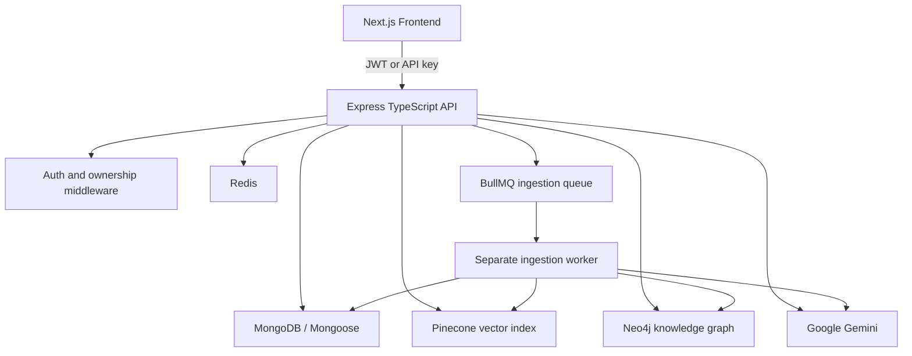

# NeuroStack AI - Complete Project Documentation

## 1. Project Overview

NeuroStack AI is a full-stack document intelligence and AI workspace platform. A user can upload private documents, connect a public URL or GitHub repository, index that content, and ask grounded questions through a real-time chat interface.

The platform combines three kinds of search and intelligence:

- **RAG search:** finds semantically relevant document chunks using Pinecone.
- **Knowledge graph search:** finds entities and relationships using Neo4j.
- **Generative AI:** uses Google Gemini to generate answers, summaries, analyses, and other tool results.

The application has two main parts:

- **Frontend:** Next.js, React, TypeScript, Tailwind CSS, Framer Motion, and TanStack Query.
- **Backend:** Node.js, Express, and TypeScript REST API.

## 2. Main Features

### 2.1 User authentication

- Local registration and login with email and password.
- Password hashing with `bcryptjs`.
- JWT authentication for normal application requests.
- Optional email verification through SMTP or a development verification URL.
- Optional Google OAuth login.
- Profile update and password change.
- User roles: `user` and `admin`.
- Account activation status and last-login tracking.

### 2.2 Private knowledge base

Users can create a personal knowledge base from:

- PDF files.
- DOCX/Word files.
- XLSX/Excel files.
- PPTX/PowerPoint files.
- Public web pages.
- GitHub repositories, including supported private repository access through a token.

Each source belongs to one user. Ownership middleware prevents another user from indexing, reading, querying, or deleting it.

### 2.3 Document ingestion pipeline

The ingestion pipeline converts a source into searchable AI knowledge:

1. The source is uploaded or downloaded and a MongoDB `Knowledge` record is created.
2. The document parser extracts text and source metadata such as page, slide, or sheet information.
3. Text is split into overlapping chunks.
4. Chunks are saved in MongoDB.
5. Text is embedded and indexed in Pinecone.
6. Gemini extracts entities and relationships from the content.
7. Entities and relationships are written to Neo4j.
8. The source status becomes `ready`.

Possible source statuses are:

`uploaded -> processing -> parsing -> chunking -> vector_indexing -> graph_indexing -> ready`

If a step fails, the status becomes `failed`, and the current step, error message, retry count, and last attempt time are stored. The pipeline is designed to be retryable and cleans previous indexes before re-indexing.

### 2.4 RAG chat

A user can create conversations attached to a knowledge source or use a general conversation. For each question:

1. Recent conversation messages are loaded from MongoDB for memory.
2. The question is converted into a vector representation.
3. Pinecone returns the most relevant user-scoped chunks.
4. The retrieved content is passed to Gemini as grounding context.
5. Gemini generates the answer.
6. The answer and source citations are saved in MongoDB.
7. The frontend can receive the answer through Server-Sent Events (SSE), token by token.

Source citations can contain the file name, chunk number, page number, slide number, sheet name, knowledge ID, and relevance score.

### 2.5 Knowledge graph

Gemini extracts structured information from indexed documents and stores it in Neo4j.

Common entity types include:

- `Person`
- `Organization`
- `Technology`
- `Project`
- `Product`
- `Concept`
- `Location`

Relationships can include `WORKS_AT`, `USES`, `CREATED`, `PART_OF`, `COMPETES_WITH`, and `RELATED_TO`.

The Graph Explorer supports:

- Natural-language graph queries.
- Direct entity lookup.
- Entity and relationship result display.
- Source citations back to the original knowledge.
- Graph statistics.
- Interactive frontend visualization.

Neo4j is offline-tolerant during server startup. If it is unavailable, the backend can start, but graph indexing and graph queries remain unavailable until the connection is restored.

### 2.6 AI workspace tools

The modular tools API provides these tools:

1. Document summarizer.
2. Smart RAG search.
3. Bug detector.
4. Test generator.
5. Data analyzer.
6. Content rewriter.
7. Translator.
8. Email composer.
9. Code explainer.
10. Knowledge graph query.

Tools are exposed through `/api/tools/:toolName` and also through the public versioned API. Tool input depends on the selected tool, for example text, code, query, language, or knowledge ID.

### 2.7 Web and GitHub ingestion

#### URL ingestion

The URL connector:

- Accepts a public HTTP or HTTPS URL.
- Resolves the hostname before downloading.
- Rejects loopback and private network destinations to reduce SSRF risk.
- Uses a request timeout.
- Removes HTML and keeps plain text.
- Limits downloaded content size.
- Saves the result as a text source and sends it through the normal ingestion pipeline.

#### GitHub ingestion

The GitHub connector:

- Reads the repository tree through the GitHub API.
- Keeps supported text/source files.
- Excludes binaries, images, secrets, environment files, dependency folders, and lock files.
- Downloads source files in batches.
- Bundles them into a structured text source.
- Sends the bundle through the same parse, chunk, vector, and graph pipeline.

### 2.8 API keys and developer platform

Users can create API keys for external integrations. The system supports:

- API key creation.
- Listing a user's keys.
- Key revocation.
- Key rotation.
- Permission metadata.
- Last-used tracking.

The raw key is shown only once. MongoDB stores a SHA-256 hash, prefix, and masked display value rather than the raw secret.

The public API is versioned under `/api/v1` and is intended for application integrations. Swagger UI is available at `/api-docs`.

### 2.9 Analytics, feedback, and evaluation

The analytics dashboard reports real application telemetry, including:

- User and document counts.
- Query and AI-generation volume.
- Active users.
- Feedback score.
- Average response latency.
- Model usage.
- Estimated token usage.
- Latency histograms.
- Topic or keyword aggregates.
- Knowledge graph matching statistics.

Users can rate assistant messages as `helpful` or `not_helpful` and optionally provide a reason.

RAG evaluation records store question, retrieved context, generated answer, context relevance, answer relevance, faithfulness, and average score. Scores are normalized from 0 to 1.

## 3. Architecture



### Request path

1. The browser sends a request to the backend.
2. CORS, Helmet, request context, logging, JSON parsing, and rate limiting run first.
3. Authentication middleware validates a JWT or API key where required.
4. Ownership middleware checks that the requested knowledge source belongs to the authenticated user.
5. Controllers validate input and call services.
6. Services use MongoDB, Pinecone, Neo4j, Redis, BullMQ, or Gemini as needed.
7. The error middleware returns a consistent error response.

## 4. Databases and Storage

NeuroStack AI uses specialized storage systems. Each system has a different responsibility.

### 4.1 MongoDB

MongoDB is the primary application database, accessed through Mongoose. It stores users, source metadata, chunks, chats, feedback, evaluations, prompts, API keys, usage counters, and telemetry.

| Model / collection | Main purpose | Important data |
|---|---|---|
| `User` | Accounts and identity | Name, email, password hash, role, provider, verification state, plan, activity dates |
| `Knowledge` | Uploaded or connected source metadata | Owner, original name, stored file name, MIME type, size, path, ingestion status, errors, chunk count, character count |
| `KnowledgeChunk` | Parsed searchable text chunks | Knowledge ID, user ID, content, chunk index, character count, source type, page number, vector ID, embedding status |
| `Conversation` | Chat sessions | User ID, optional knowledge ID, title, timestamps |
| `Message` | User and assistant messages | Conversation ID, user ID, role, content, source citation array, timestamps |
| `ApiKey` | External integration credentials | User, name, SHA-256 key hash, prefix, masked key, permissions, active state, last-used time |
| `Feedback` | Message ratings | User, conversation, message, helpful/not-helpful rating, reason |
| `RagEvaluation` | RAG quality measurements | Question, context, answer, relevance scores, faithfulness, average score |
| `RequestLog` | AI request telemetry | User, model name, duration, token estimate, endpoint, timestamp |
| `UserUsage` | Plan usage counters | Request count, AI generation count, token count, usage period start/end |
| `Prompt` | Versioned system prompts | Prompt name, version, template, variables, active state, description |

MongoDB indexes support common lookups such as user-owned sources ordered by date, source status, conversation history, message history, API-key hash, and usage records.

### 4.2 Pinecone

Pinecone is the vector database used for semantic retrieval.

It stores vector representations and metadata for document chunks. Searches are filtered by the authenticated user's scope so one user's source content cannot appear in another user's retrieval results. A vector record is linked back to the MongoDB chunk through its vector ID.

Pinecone is used for:

- Semantic document search.
- RAG context retrieval.
- Smart RAG Search tool.
- Versioned API knowledge search.

The configured Pinecone index must support the embedding/vectorization configuration used by the backend.

### 4.3 Neo4j

Neo4j is the graph database for entities and relationships extracted from documents.

Graph records include user and knowledge ownership information. This allows graph queries and statistics to be scoped to the current user. Neo4j is also used by the Graph Explorer and graph-query AI tool.

### 4.4 Redis

Redis is used for fast, temporary, and operational data:

- Distributed/global rate limiting.
- Cached Pinecone or service responses where configured.
- BullMQ queue connection and job state.
- Ingestion retry/backoff coordination.

Redis is not the primary source of truth for users or documents; MongoDB remains the persistent application store.

### 4.5 File storage

Uploaded files and generated source bundles are stored under the backend uploads directory. MongoDB stores the file path and source metadata. Deleting a knowledge source also removes related MongoDB chunks and attempts to clean the corresponding Pinecone vectors and Neo4j graph data.

## 5. Ingestion Details

### Supported parsers

| Source | Processing behavior |
|---|---|
| PDF | Extracts text and page information with `pdf-parse`. |
| DOCX | Extracts clean document text with `mammoth`. |
| XLSX | Converts workbook sheets into text/CSV-like content with `xlsx`. |
| PPTX | Reads slide XML from the archive and preserves slide order. |
| URL | Downloads safe public page content and converts HTML to text. |
| GitHub | Bundles filtered repository source files into text. |

### Queue and worker

The API places ingestion jobs on the BullMQ `document-ingestion` queue. A separate worker process consumes those jobs so CPU-heavy parsing, Gemini extraction, and database writes do not block HTTP requests.

Default queue behavior:

- Up to 3 attempts per job.
- Exponential backoff starting at 5 seconds.
- Completed jobs are removed.
- Failed jobs remain available for investigation.

Start the worker separately in development with:

```bash
cd backend
npm run worker:dev
```

## 6. Authentication and Security

### Accepted credentials

Protected endpoints accept either:

```text
Authorization: Bearer <jwt>
```

or:

```text
X-API-Key: ns_<key>
```

The API key may also be supplied as a bearer value when supported by the authentication middleware.

### Security controls

- Passwords are hashed with bcrypt.
- Verification tokens are hashed before storage.
- API keys are stored as hashes and are shown only once.
- Knowledge ownership is checked before source operations.
- Pinecone retrieval is user-scoped.
- Neo4j graph records and queries are user-scoped.
- Helmet adds common HTTP security headers.
- CORS restricts browser access to the configured frontend URL.
- Global and authentication-specific rate limiting are enabled.
- Uploads use extension/MIME checks plus magic-byte validation.
- URL ingestion checks DNS results and blocks private/loopback destinations.
- Errors are sanitized so credentials and database connection strings are not leaked.

## 7. API Reference

Base URL in local development: `http://localhost:5000/api`

### Health

| Method | Endpoint | Purpose |
|---|---|---|
| GET | `/health` | Reports MongoDB and Redis health. |

### Authentication

| Method | Endpoint | Purpose |
|---|---|---|
| POST | `/auth/register` | Create a local account. |
| POST | `/auth/login` | Log in and receive a JWT. |
| POST | `/auth/verify-email` | Verify an email token. |
| POST | `/auth/resend-verification` | Send a new verification link. |
| GET | `/auth/google` | Start Google OAuth. |
| GET | `/auth/google/callback` | Complete Google OAuth. |
| GET | `/auth/me` | Return the current user. |
| PUT | `/auth/me` | Update the profile. |
| PUT | `/auth/password` | Change the password. |

### Knowledge sources

| Method | Endpoint | Purpose |
|---|---|---|
| POST | `/knowledge/upload` | Upload PDF, DOCX, XLSX, or PPTX. |
| GET | `/knowledge` | List the current user's sources. |
| POST | `/knowledge/:id/index` | Queue ingestion for a source. |
| DELETE | `/knowledge/:id` | Delete a source and related indexes. |
| POST | `/knowledge/url` | Add a public URL source. |
| POST | `/knowledge/github` | Add a GitHub repository source. |

### Chat

| Method | Endpoint | Purpose |
|---|---|---|
| POST | `/chat/conversations` | Create a conversation. |
| GET | `/chat/conversations` | List conversations. |
| GET | `/chat/conversations/:id/messages` | Read message history. |
| POST | `/chat/conversations/:id/messages` | Send a non-streaming RAG message. |
| POST | `/chat/conversations/:id/messages/stream` | Send a streaming SSE RAG message. |
| DELETE | `/chat/conversations/:id` | Delete a conversation. |

### Graph

| Method | Endpoint | Purpose |
|---|---|---|
| POST | `/graph/query` | Query the user's graph in natural language. |
| POST | `/graph/entity` | Look up a graph entity. |
| GET | `/graph/stats` | Return graph node and relationship counts. |

### AI tools

| Method | Endpoint | Purpose |
|---|---|---|
| GET | `/tools` | List available tools. |
| POST | `/tools/:toolName` | Execute one tool. |

### Feedback and evaluation

| Method | Endpoint | Purpose |
|---|---|---|
| POST | `/feedback` | Submit message feedback. |
| GET | `/feedback/message/:messageId` | Read feedback for a message. |
| GET | `/evaluation/stats` | Get RAG evaluation statistics. |
| POST | `/evaluation/run` | Run a manual evaluation. |

### API keys and analytics

| Method | Endpoint | Purpose |
|---|---|---|
| GET | `/apikeys` | List API keys. |
| POST | `/apikeys` | Create an API key. |
| DELETE | `/apikeys/:id` | Revoke an API key. |
| POST | `/apikeys/:id/rotate` | Rotate an API key. |
| GET | `/apikeys/usage/overview` | Show API key/usage overview. |
| GET | `/analytics/stats` | Return platform analytics. |

### Versioned public API

The integration API is mounted at `/api/v1` and uses API-key authentication.

| Method | Endpoint | Purpose |
|---|---|---|
| POST | `/v1/knowledge/search` | Semantic knowledge search. |
| POST | `/v1/knowledge/upload` | Upload a knowledge source. |
| GET | `/v1/knowledge/:id` | Read source status. |
| POST | `/v1/chat` | Send a RAG chat request. |
| POST | `/v1/tools/:toolName` | Execute a workspace tool. |

Full request and response schemas are available in Swagger at `/api-docs`.

## 8. Frontend Screens

The Next.js frontend currently includes:

- Landing page.
- Login and registration pages.
- Protected dashboard shell.
- Main chat workspace.
- Conversation history and chat deletion.
- Document management modal.
- File, URL, and GitHub source management.
- Streaming assistant answers with citations.
- Helpful/not-helpful feedback controls.
- Graph Explorer.
- Analytics Console.
- Developer/API key area.
- Settings and profile management.

## 9. Plans and Usage Limits

The backend defines two plans:

| Plan | Requests | AI generations | Tokens | Documents | Storage |
|---|---:|---:|---:|---:|---:|
| Free | 100 | 10 | 20,000 | 3 | 5 MB |
| Developer | 10,000 | 1,000 | 2,000,000 | 50 | 250 MB |

Usage is tracked in MongoDB in `UserUsage`. Limits are enforced by the backend middleware/services. The global Redis-backed rate limiter is separate from plan usage limits.

## 10. Local Setup

### Prerequisites

- Node.js 18 or newer.
- MongoDB, local or MongoDB Atlas.
- Redis.
- Neo4j, local or Neo4j AuraDB.
- Pinecone account and configured index.
- Google Gemini API key.
- Optional SMTP credentials for email verification.
- Optional Google OAuth credentials.

### Backend

```bash
cd backend
npm install
npm run dev
```

Run the ingestion worker in another terminal:

```bash
cd backend
npm run worker:dev
```

### Frontend

```bash
cd frontend
npm install
npm run dev
```

The default local URLs are:

- Frontend: `http://localhost:3000`
- Backend: `http://localhost:5000`
- Health: `http://localhost:5000/api/health`
- Swagger: `http://localhost:5000/api-docs`
- Neo4j Browser: `http://localhost:7474`

### Docker Compose

From the repository root:

```bash
docker compose up --build
```

The development compose file starts MongoDB, Neo4j, Redis, backend, and frontend. Persistent Docker volumes are used for MongoDB, Neo4j, and Redis data.

## 11. Environment Variables

The backend requires:

```env
MONGODB_URI=mongodb://localhost:27017/neurostack
JWT_SECRET=replace-with-a-long-random-secret
GEMINI_API_KEY=your-gemini-key
```

Common optional/configuration values include:

```env
PORT=5000
FRONTEND_URL=http://localhost:3000
GEMINI_MODEL=gemini-2.0-flash
PINECONE_API_KEY=your-pinecone-key
PINECONE_INDEX_NAME=your-index
NEO4J_URI=bolt://localhost:7687
NEO4J_USERNAME=neo4j
NEO4J_PASSWORD=your-password
REDIS_URL=redis://localhost:6379
APP_URL=http://localhost:3000
REQUIRE_EMAIL_VERIFICATION=false
SMTP_HOST=
SMTP_PORT=
SMTP_USER=
SMTP_PASS=
SMTP_FROM=
GOOGLE_CLIENT_ID=
GOOGLE_CLIENT_SECRET=
```

Never commit real credentials, JWT secrets, SMTP passwords, OAuth secrets, or API keys.

## 12. Testing and Build Commands

Backend tests use Vitest and mock external services where possible:

```bash
cd backend
npm test
npm run build
```

Frontend checks and production build:

```bash
cd frontend
npm run lint
npm run build
```

Frontend end-to-end tests use Playwright:

```bash
cd frontend
npm run e2e
```

Relevant test coverage includes authentication, ownership authorization, rate limiting, error handling, document parsing, URL/GitHub scraping, graph ingestion, Redis cache behavior, API keys, RAG evaluation, and usage tracking.

## 13. Operational Notes

- MongoDB and Redis are required for normal API health.
- Neo4j is optional at startup but required for graph functionality.
- The ingestion worker must be running for queued indexing jobs to complete.
- Pinecone must be configured before semantic search or RAG can work.
- Gemini is required for answer generation, embeddings/extraction, and AI tools.
- Failed ingestion details are stored on the `Knowledge` record and should be checked before retrying.
- Production deployments should use strong secrets, protected database credentials, TLS, restricted network access, and the production Docker Compose configuration.
